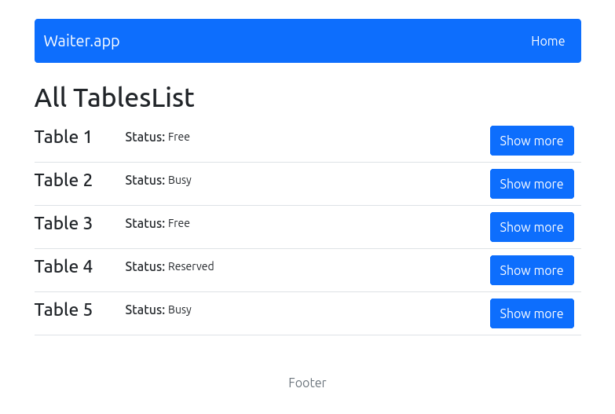

# Waiter App

A restaurant table management app built with React, Redux, and JSON Server. It allows staff to view, update, and track the status of each table in real-time.

## Preview

 

## Features

- View all tables with current status (Free / Busy / Reserved)
- Select table and update:
  - Status
  - Number of people
  - Bill (if status is Busy)
- State management with Redux + Thunk
- Routing with React Router v6
- Responsive UI styled with Bootstrap 5
- Fake API via JSON Server

## Tech Stack

- **Frontend:** React, React Router, Redux, Redux Thunk, SCSS, Bootstrap
- **Backend:** JSON Server (mock REST API)
- **Tooling:** Create React App, Yarn

## Installation

```bash
git clone https://github.com/cayceworld/waiter-app.git
cd waiter-app
yarn install
yarn start

